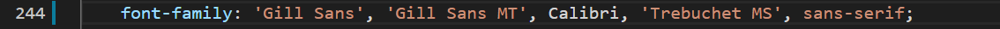

# horiseon-seo

## About

This projects aims to correct minior mistakes and make the original code for the horiseon seo more accesable. Comments have also been added to the css, detailing what each command generally does.

### Corrections
Most of the divs were replaced with other division elements such as section and aside for clearity.

Comments were added to each section to denote the contents of each section.

All images were given alt names in case the browser is unable to load them.

An id was addded to the article containting the class search engine optimizatoin, allowing the link in the navigation bar to properly redirect to the correct location on the page.

One error corrected in the style.css file was the lack of quotes as seen below.

The correction is as follows.

## Credits

Origingal index.html and styles.css downlaoded from: https://unchar.bootcampcontent.com/The-Coding-Bootcamp/uncc-virt-fsf-ft-02-2021-u-c

